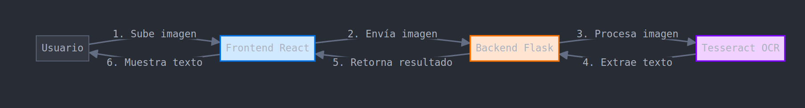

# Procesador de Recibos con OCR



Este proyecto es una aplicación web para procesar imágenes de recibos utilizando tecnología OCR (Reconocimiento Óptico de Caracteres). Permite a los usuarios cargar imágenes de recibos, procesarlas y extraer el texto contenido en ellas.

## Características

- Frontend interactivo desarrollado con React y TypeScript
- Backend con Flask utilizando Tesseract OCR
- Validación de archivos y procesamiento de errores
- Interfaz de usuario intuitiva con vista previa de imágenes
- Soporte para múltiples formatos de imagen
- Diseño responsivo para diferentes dispositivos

## Estructura del Proyecto

```
ocr-receipts/
├── frontend/                # Aplicación React
│   ├── src/
│   │   ├── App.tsx          # Componente principal
│   │   ├── App.css          # Estilos CSS
│   │   ├── index.tsx        # Punto de entrada
│   │   └── index.css        # Estilos globales
│   └── package.json         # Dependencias del frontend
├── backend/
│   ├── app.py               # API Flask
│   ├── ocr_service.py       # Servicio OCR con Tesseract
│   └── requirements.txt     # Dependencias del backend
└── Dockerfile               # Configuración para Docker
```

## Instalación y Ejecución

### Requisitos Previos

- Node.js y npm para el frontend
- Python 3.8+ para el backend
- Tesseract OCR instalado en el sistema
- Docker (opcional, para contenedorización)

### Instalación en Entorno Local

#### Backend (Flask)

1. Crear un entorno virtual de Python:
   ```bash
   python -m venv venv
   source venv/bin/activate  # En Windows: venv\Scripts\activate
   ```

2. Instalar dependencias:
   ```bash
   pip install -r backend/requirements.txt
   ```

3. Instalar Tesseract OCR según tu sistema operativo:
   - **Windows**: Descargar e instalar desde [Tesseract at UB Mannheim](https://github.com/UB-Mannheim/tesseract/wiki)
   - **macOS**: `brew install tesseract`
   - **Ubuntu/Debian**: `sudo apt install tesseract-ocr tesseract-ocr-spa`

4. Ejecutar el servidor Flask:
   ```bash
   cd backend
   python app.py
   ```
   El servidor estará disponible en http://localhost:5000

#### Frontend (React)

1. Instalar dependencias:
   ```bash
   cd frontend
   npm install
   ```

2. Ejecutar el servidor de desarrollo:
   ```bash
   npm start
   ```
   La aplicación estará disponible en http://localhost:3000

### Despliegue con Docker

Para un despliegue completo utilizando Docker:

1. Construir la imagen Docker:
   ```bash
   docker build -t ocr-receipts-app .
   ```

2. Ejecutar el contenedor:
   ```bash
   docker run -p 5000:5000 ocr-receipts-app
   ```

3. Acceder a la aplicación en `http://localhost:5000` (si el frontend está incluido) o conectar tu frontend a la API en ese puerto.

## Justificación Técnica

### 1. Arquitectura Frontend-Backend Separada

La aplicación utiliza una arquitectura cliente-servidor separada con:
- **Frontend**: React para una interfaz de usuario dinámica y responsiva
- **Backend**: Flask para un API REST eficiente

**Beneficios**:
- **Escalabilidad**: Cada capa puede escalar independientemente
- **Mantenibilidad**: Separación clara de responsabilidades
- **Desarrollo paralelo**: Equipos pueden trabajar simultáneamente en ambas partes

### 2. Elección de Tecnologías

#### React + TypeScript

React fue elegido por:
- **Rendimiento**: Renderizado eficiente con su DOM virtual
- **Componentización**: Estructura modular y reutilizable
- **Ecosistema**: Amplia comunidad y herramientas disponibles

TypeScript añade:
- **Tipado estático**: Detección temprana de errores
- **Mejor documentación**: Los tipos actúan como documentación en el código
- **Autocompletado y refactorización**: Mejora la productividad de desarrollo

#### Flask

Flask fue seleccionado por:
- **Ligereza**: Framework minimalista y flexible
- **Simplicidad**: Fácil de configurar y entender
- **Extensibilidad**: Se pueden añadir funcionalidades según sea necesario

#### Tesseract OCR

Tesseract es la opción ideal porque:
- **Código abierto**: Sin costos de licencia
- **Precisión**: Alto nivel de precisión en el reconocimiento de texto
- **Multilenguaje**: Soporte para múltiples idiomas
- **Comunidad activa**: Desarrollo continuo y soporte

### 3. Consideraciones de Seguridad

El proyecto implementa:
- **Validación de archivos**: Comprueba tipos y tamaños de archivos
- **Sanitización de nombres de archivo**: Previene ataques de path traversal
- **CORS configurado**: Controla accesos desde dominios específicos
- **Manejo temporal de archivos**: Elimina archivos después de procesarlos

### 4. Optimizaciones de Rendimiento

- **Carga asíncrona**: Procesamiento sin bloqueo del hilo principal
- **Vista previa optimizada**: Generación eficiente de vistas previas
- **Manejo de estados de carga**: Feedback visual durante el procesamiento
- **Límites de tamaño de archivo**: Previene sobrecarga del servidor

### 5. Usabilidad y Experiencia de Usuario

- **Diseño intuitivo**: Interfaz clara y sencilla
- **Feedback inmediato**: Estados de carga y resultados visibles
- **Manejo de errores**: Mensajes claros cuando algo falla
- **Diseño responsivo**: Funciona en móviles y escritorio

### 6. Despliegue y Producción

La aplicación está preparada para entornos de producción con:
- **Configuración Docker**: Entorno consistente y aislado
- **Variables de entorno**: Configuración flexible entre entornos
- **Optimización de recursos**: Uso eficiente de CPU y memoria
- **Capas de caché en Docker**: Reconstrucciones rápidas

## Mejores Prácticas para Producción

1. **Implementar HTTPS**: Para transferencias seguras de datos
2. **Añadir autenticación**: Limitar acceso a usuarios autorizados
3. **Monitorización y logging**: Implementar sistema de logs estructurados
4. **Respaldos regulares**: Especialmente si se almacenan resultados de OCR
5. **Escalado horizontal**: Utilizar múltiples instancias detrás de un balanceador

## Troubleshooting

### Problemas Comunes

1. **OCR no detecta texto correctamente**:
   - Asegúrate de que la imagen sea clara y con buen contraste
   - Verifica que el idioma adecuado de Tesseract esté instalado
   - Considera pre-procesar las imágenes (binarización, deskew)

2. **Errores de CORS**:
   - Verifica que la configuración CORS permita tu dominio frontend
   - Asegúrate que el frontend use el puerto y host correctos para la API

3. **Tesseract no encontrado**:
   - Comprueba que Tesseract esté instalado correctamente
   - Verifica la variable PATH del sistema (o configura explícitamente en el código)

4. **Servidor no responde**:
   - Revisa los logs del servidor para identificar errores
   - Verifica que los puertos no estén bloqueados por un firewall

5. **Problemas en Docker**:
   - Asegúrate de exponer el puerto correcto
   - Verifica que Tesseract esté instalado en la imagen
   - Revisa permisos de escritura para la carpeta de uploads